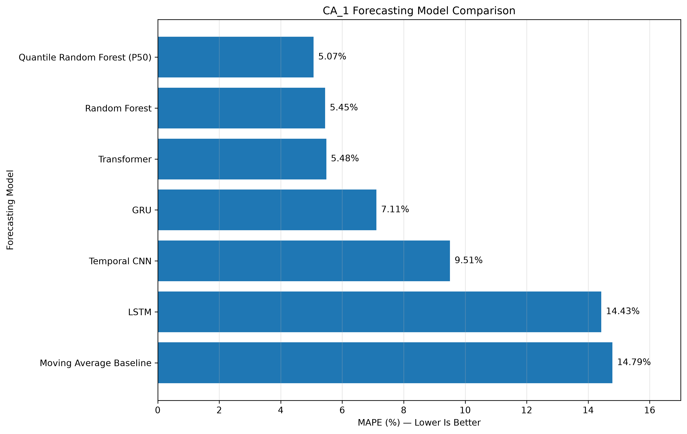
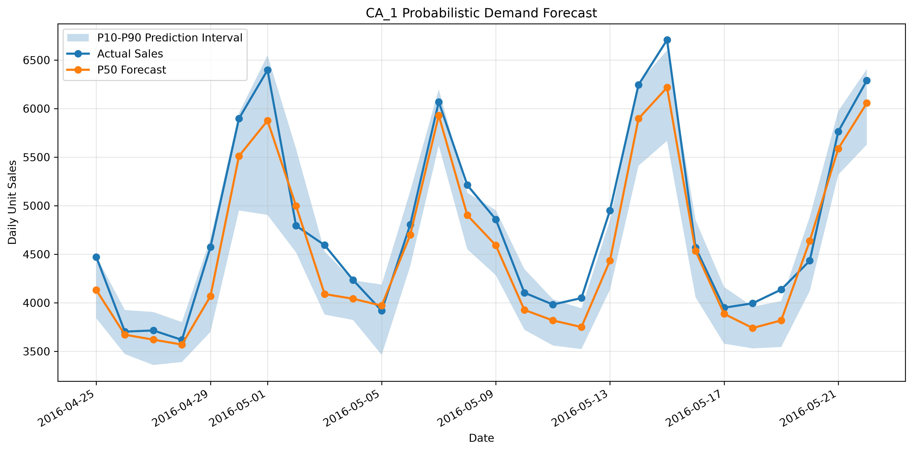
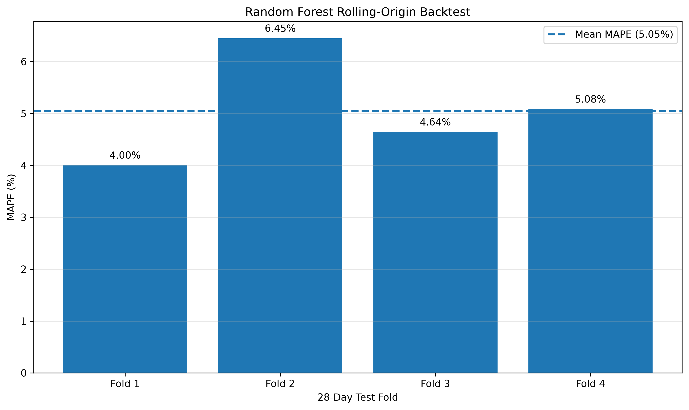

# Advanced Retail Demand Forecasting

## 🚀 Live Demo

Explore the interactive forecasting dashboard:

**[Launch the Streamlit Dashboard](https://advanced-retail-demand-forecasting-3dxseifxt5jxayowuc7j3.streamlit.app/)**

The dashboard includes:
- Model comparison across 7 forecasting approaches
- Probabilistic demand forecasting with P10, P50 and P90 estimates
- Rolling-origin backtesting
- Hierarchical forecasting across store, category and department levels

An end-to-end machine learning and deep learning project for retail demand forecasting using the **M5 Forecasting Accuracy dataset**.

The project compares statistical baselines, machine learning, deep learning, hierarchical forecasting, and probabilistic forecasting using chronological evaluation and rolling-origin backtesting.

## Project Objective

Retail demand forecasting helps businesses make better decisions about inventory, replenishment, product availability, workforce planning, promotions, and waste reduction.

The objective of this project is to build and evaluate multiple forecasting approaches for the **CA_1 store** in the M5 dataset and determine which models provide the most accurate and reliable demand forecasts.

## Dataset

The project uses the M5 Forecasting Accuracy dataset, which contains:

* 3,049 products
* 7 departments
* 3 categories
* 10 stores
* 3 US states
* Daily sales history
* Calendar and event information
* SNAP indicators
* Product selling prices

The main modelling work focuses on the **CA_1 store**, containing 3,049 product-level sales series.

## Forecasting Models

Seven forecasting approaches were evaluated:

| Model | MAE | RMSE | MAPE |

|---|---:|---:|---:|

| Quantile Random Forest (P50) | **249.18** | **293.37** | **5.07%** |

| Random Forest | 276.74 | 346.11 | 5.45% |

| Transformer | 272.55 | 339.93 | 5.48% |

| GRU | 353.28 | 418.39 | 7.11% |

| Temporal CNN | 461.63 | 520.77 | 9.51% |

| LSTM | 750.53 | 984.40 | 14.43% |

| Moving Average Baseline | 734.93 | 913.78 | 14.79% |

The **Quantile Random Forest P50 forecast achieved the best holdout MAPE of 5.07%**.

## Feature Engineering

The forecasting pipeline uses time-series features designed to capture recent demand patterns, seasonality, calendar effects, and retail events.

### Lag Features

- Lag 1

- Lag 7

- Lag 14

- Lag 28

### Rolling Features

- 7-day rolling mean

- 28-day rolling mean

- 7-day rolling standard deviation

- 28-day rolling standard deviation

Rolling statistics are shifted so that the current day's target value is not included in its own features.

### Calendar and Event Features

Additional features include:

- Day of week

- Day of month

- Month

- Year

- Week of year

- Weekend indicator

- SNAP indicator

- Cultural events

- National events

- Religious events

- Sporting events

- Super Bowl

- Valentine's Day

- Christmas

## Probabilistic Forecasting

Point forecasts provide a single estimate of future demand but do not communicate uncertainty.

The project therefore uses predictions from the individual trees in the Random Forest ensemble to generate empirical prediction quantiles:

- **P10** - lower prediction bound

- **P50** - median demand forecast

- **P90** - upper prediction bound

The P10-P90 interval represents a nominal 80% prediction interval.

### Final 28-Day Results

| Metric | Result |

|---|---:|

| P50 MAE | 249.18 |

| P50 RMSE | 293.37 |

| P50 MAPE | **5.07%** |

| P10-P90 empirical coverage | 71.43% |

| Average interval width | 700.31 units |

## Rolling-Origin Backtesting

A single train/test split may not provide a reliable estimate of forecasting performance. To evaluate stability across time, the probabilistic Random Forest was tested using four historical 28-day evaluation windows.

| Fold | Test Period | MAE | RMSE | MAPE | P10-P90 Coverage |

|---|---|---:|---:|---:|---:|

| 1 | 1 Feb - 28 Feb 2016 | 187.70 | 281.64 | 4.00% | 85.71% |

| 2 | 29 Feb - 27 Mar 2016 | 303.16 | 371.59 | 6.45% | 85.71% |

| 3 | 28 Mar - 24 Apr 2016 | 203.59 | 252.72 | 4.64% | 89.29% |

| 4 | 25 Apr - 22 May 2016 | 249.89 | 294.95 | 5.08% | 78.57% |

Across all **112 out-of-sample observations**:

| Metric | Result |

|---|---:|

| MAE | **236.08** |

| RMSE | **303.42** |

| MAPE | **5.05%** |

| P10-P90 Coverage | **84.82%** |

The backtesting results demonstrate that the model maintains strong forecasting accuracy across multiple historical periods rather than relying on a single favourable holdout window.

## Hierarchical Forecasting

Retail demand exists at multiple aggregation levels. This project constructs a forecasting hierarchy for the CA_1 store:

Store -> Category -> Department

The hierarchy contains:

- 1 store-level series

- 3 category-level series

- 7 department-level series

The three categories are **FOODS**, **HOBBIES**, and **HOUSEHOLD**.

Forecast reconciliation validation confirms that category and department forecasts aggregate exactly to the CA_1 store forecast.

This is important in retail because forecasts produced at different organisational levels should remain mathematically consistent.

## Evaluation Methodology

All model evaluation uses chronological data splitting rather than random train/test splitting.

The primary model comparison uses the final **28 days** as the holdout period.

Lag and rolling features use historical observations only, preventing the current day's target from entering its own predictors.

The evaluation represents a **rolling one-step-ahead forecasting setting**. As the evaluation period progresses, previously observed sales become available for subsequent lag and rolling features.

Therefore, these results should not be interpreted as a fully recursive 28-day forecast generated entirely from information available before the start of the holdout period.

## Project Structure

advanced-retail-demand-forecasting/

|

+-- data/

|   +-- raw/

|   +-- processed/

|

+-- models/

|

+-- reports/

|   +-- figures/

|

+-- src/

|   +-- data/

|   +-- features/

|   |   +-- build_features.py

|   |   +-- build_calendar_features.py

|   |   +-- build_price_features.py

|   |   +-- build_hierarchy.py

|   |

|   +-- models/

|   |   +-- random_forest.py

|   |   +-- gru_forecast.py

|   |   +-- lstm_forecast.py

|   |   +-- temporal_cnn.py

|   |   +-- transformer_model.py

|   |   +-- quantile_random_forest.py

|   |   +-- hierarchical_forecast.py

|   |

|   +-- evaluation/

|       +-- compare_models.py

|       +-- backtest_random_forest.py

|       +-- check_forecast_reconciliation.py

|       +-- plot_probabilistic_forecast.py

|       +-- plot_backtest_performance.py

|       +-- plot_model_comparison.py

|

+-- README.md

+-- requirements.txt

## Technologies

The project uses:

- Python

- Pandas

- NumPy

- Scikit-learn

- TensorFlow / Keras

- PyTorch

- Matplotlib

- Git

- GitHub

- PowerShell

- Python virtual environments

## Key Findings

The main findings from the project are:

- Quantile Random Forest P50 achieved the best final holdout MAPE at **5.07%**.

- Standard Random Forest achieved **5.45% MAPE**.

- Transformer achieved **5.48% MAPE**.

- GRU achieved **7.11% MAPE**.

- Rolling-origin backtesting produced an overall **5.05% MAPE across 112 out-of-sample observations**.

- P10-P90 intervals achieved **84.82% empirical coverage across the four-fold backtest**.

- Hierarchical reconciliation produced coherent forecasts across store, category, and department levels.

- Tree-based models were highly competitive with the deep-learning architectures on this structured retail forecasting problem.

## Business Value

Accurate retail demand forecasts can support:

- Inventory replenishment

- Product availability

- Safety-stock planning

- Supply-chain planning

- Promotion planning

- Workforce planning

- Warehouse capacity planning

- Waste reduction

Probabilistic forecasting adds additional business value by quantifying uncertainty.

For example, the P50 forecast can represent expected demand, while higher quantiles such as P90 can support more conservative inventory decisions when the cost of stockouts is high.

## Future Improvements

Future development could include:

- Fully recursive multi-step forecasting

- XGBoost and LightGBM

- Automated hyperparameter optimisation

- Conformal prediction intervals

- Prediction interval calibration

- Temporal Fusion Transformer

- N-BEATS

- Product-level probabilistic forecasting

- MinT hierarchical forecast reconciliation

- Automated model monitoring

- Streamlit forecasting dashboard

- Cloud deployment

## Author

**Yogeshwaran Doresamy**

MSc Data Science

Focus areas: Data Science, Machine Learning, Artificial Intelligence, Time-Series Forecasting and Retail Analytics.
